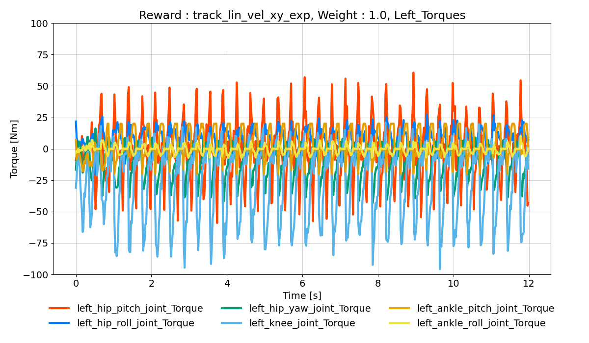
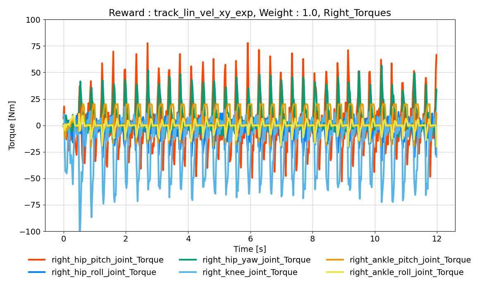
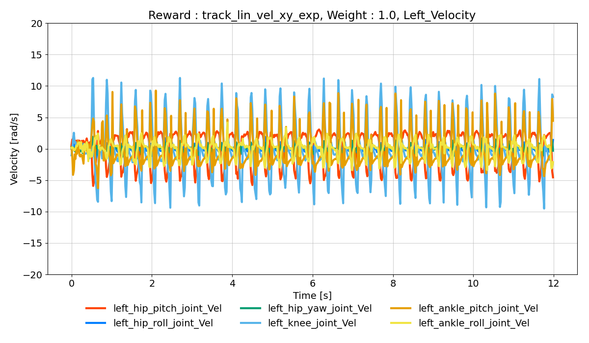
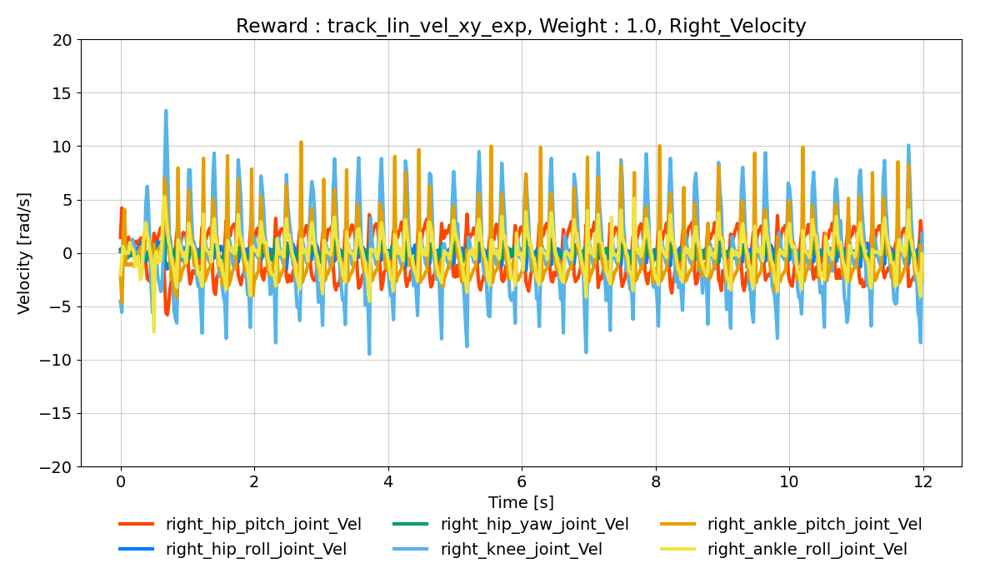
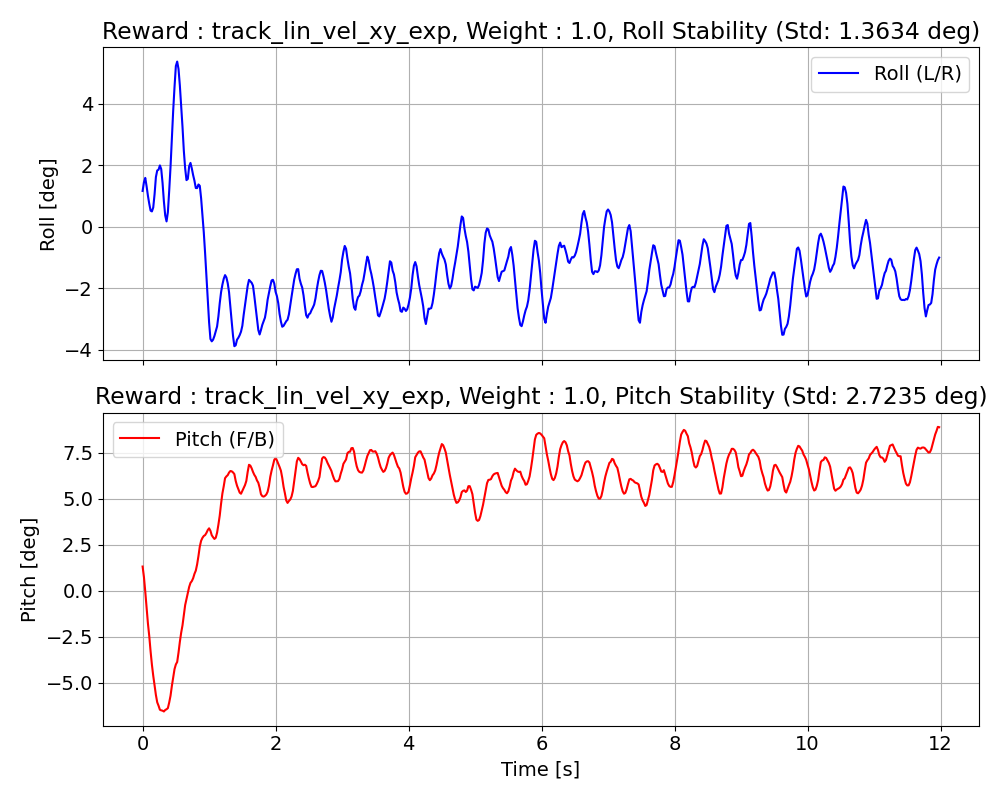
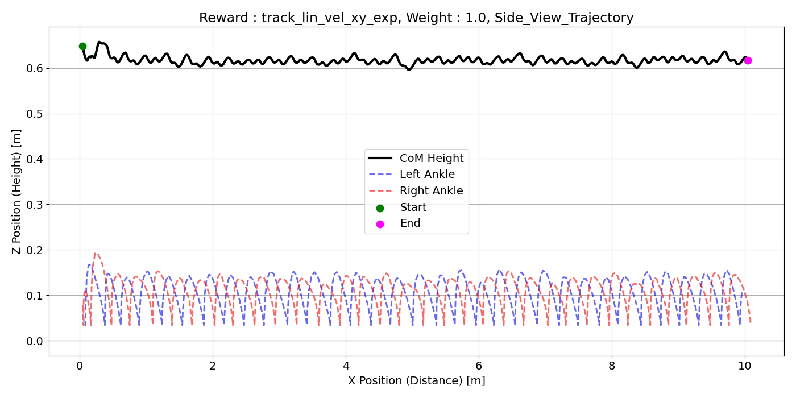
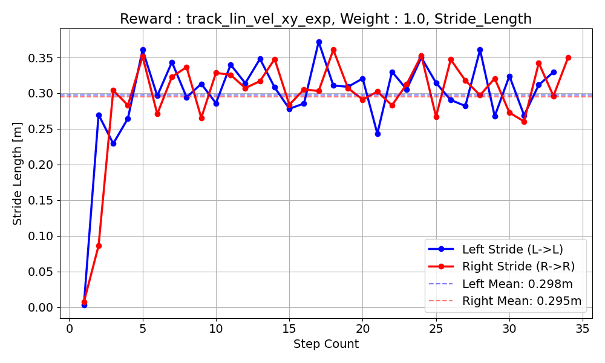
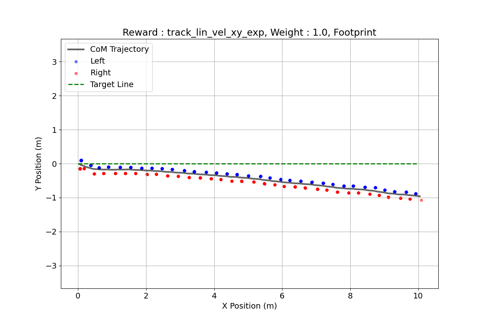
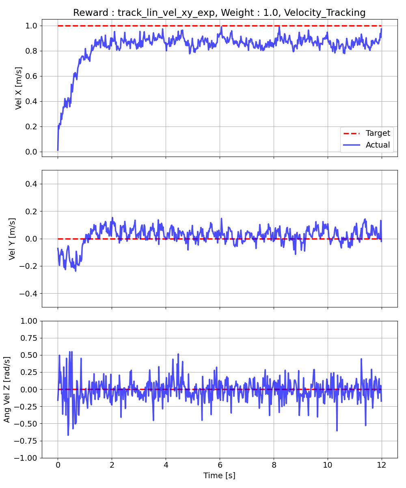
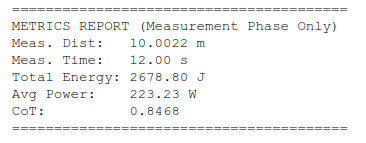

# gait_data_analysis の説明

## data_logger.py
10mを歩行して，以下のグラフのcsvデータとそのプロットを行う．

<video src="png/video.mp4" width="600" controls></video>

| 左足関節トルク | 右足関節トルク |
| :---: | :---: |
|  |  |

| 左足関節角速度 | 右足関節角速度 |
| :---: | :---: |
|  |  |

| 胴体の姿勢偏差 | 重心位置と足上げ高さ |
| :---: | :---: |
|  |  |

| 歩幅 | 2次元足跡 |
| :---: | :---: |
|  |  |

| 速度追従 | metrics_report |
| :---: | :---: |
|  |  |

## run_eval_test.sh
data_logger.pyを自動で実行するためのスクリプト．ただし，報酬項のタイトルを変更する必要がある．

## copy_data.sh
Docker内の上記グラフデータをポストへコピーする．